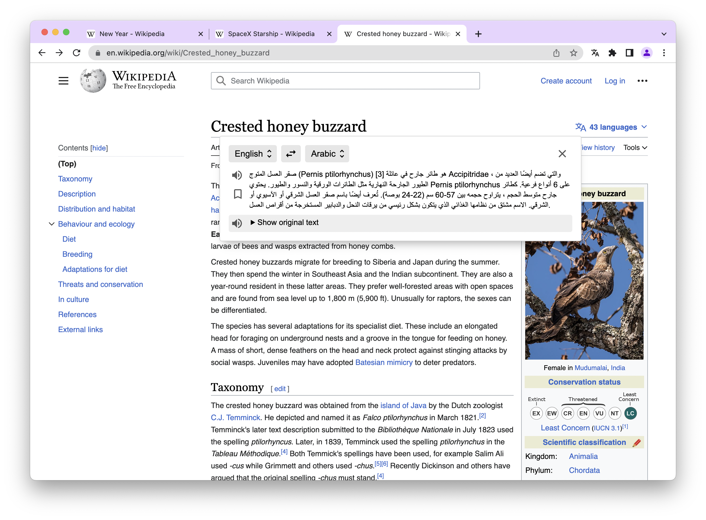
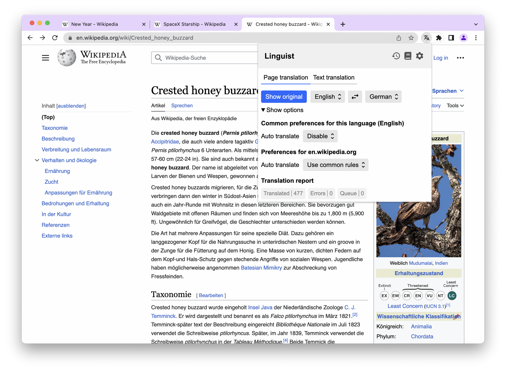
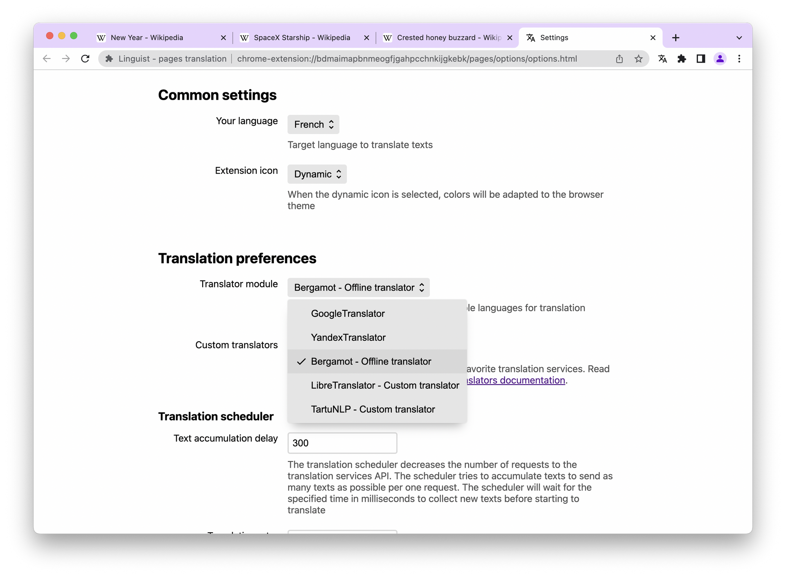
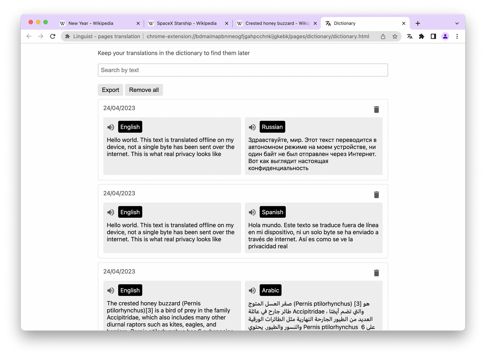

The web-browser is the most used program for me and for most users of the internet, so it is important for browser to work efficiently during daily use. Altough most browsers have embedded translation features and there exists a lot of browser extensions providing translation capabalities, I have found them to be not good enough and unacceptable for intensive use. This is why I have created Linguist - the ultimate browser extension for translation.

I started development of [Linguist](https://github.com/translate-tools/linguist) in *June of 2020*, when I tried to find a solution for my translation needs while using the browser but I couldn't find one that worked as needed. I did find one extension - [mate translate](https://gikken.co/mate-translate/), whose quality stood out and it even had a good UI. However it is not an open source project, it collects analytics and even some of the basic features like history and dictionary are available only to paid users.

A common problem for all browser extensions is that they are just wrappers over google translator widget. Google's translator is good, but it is far from ideal and there are other translators which work better for some languages and use cases.

# Meet Linguist

[Linguist](https://github.com/translate-tools/linguist) is an all-in one translation solution which you can use for full page translations, translation of selected texts, paste text for translate and a text to speech feature. You can also add important translations to a dictionary to find it later if you learn languages like me.

## Use your favorite translation service

Linguist has a few embedded translators, include google translator, and you can add your favorite translator to linguist yourself with [custom translators](https://github.com/translate-tools/linguist/blob/bcc8c471fdede42b6bbc541144eb89a93587f605/docs/CustomTranslator.md) button. I really like this powerful feature - with Linguist you are not locked to using Google Translator anymore!

Look, you can just insert any JavaScript code that implement translator interface:

## Keep your privacy

Starting from version 5.0, Linguist includes embedded offline translator, based on [Bergamot project](https://github.com/browsermt/bergamot-translator) - mozilla's machine translation project, compiled to WebAssembly.

With the offline translator, you will not be sending your private texts over internet at all! The translation runs on your device locally once you have downloaded the AI models for the languages you want translate to and from.

Unlike other browser extensions, Linguist is not just wrapper over Google Translator Widget, so all translation features are available offline with offline translator, thus you can use all Linguist features and stay private.

## Learn the languages

With the dictionary feature, you can bookmark translations and find them later, when you need those expressive words you found earlier. I like this feature as well and my dictionary has about 800+ translated texts already. Of course, you can search in your dictionary with a fuzzy search.

These features makes Linguist the ideal tool for traveling, because it saves your internet bandwidth and enables translation even if you are offline due to the lack of a data connection. You can even find words using the search functionality of the offline dictionary.

Linguist works on smartphones, but it does not work on iOS because iOS does not have a browser that supports the WebExtensions API, only Safari. I'm sad to see that my friends who use an iPhone can't even translate the restaurant menu and they look surprised when I translate sites on my Android device with Linguist.

## Try and share

Linguist is a completely free and open source tool that respects your privacy.

Try Linguist today and share it with your friends, followers and community.
- [Chrome](https://chrome.google.com/webstore/detail/gbefmodhlophhakmoecijeppjblibmie)
- [Firefox](https://addons.mozilla.org/addon/linguist-translator/)
  - Read the guide [how to install on android](https://github.com/translate-tools/linguist#android)

Rate Linguist on your browser's store. Let's make Linguist more popular together. Create activity on social media, share links to Linguist to help promote a good tool you like.

If you have bugs or feature requests - [create issue](https://github.com/translate-tools/linguist/issues/new), your feedback is important and appreciated.
