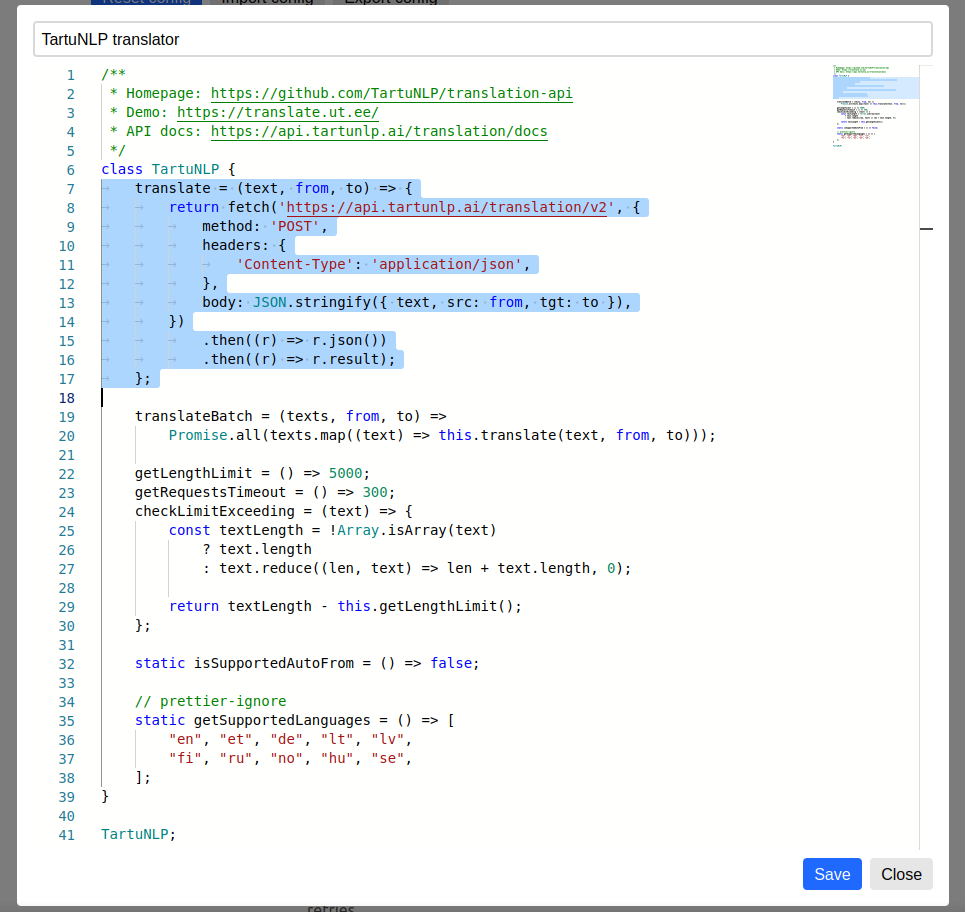

A browser is the most used program for me and for most users of the internet, so it is important for browser to work efficiently. Altough many browsers have embedded translation features and there exists many browser extensions for translation, I believe they are not of sufficient quality and are not acceptable for intensive use. This is why I've create Linguist - the ultimate browser extension for translation.

I started development of [Linguist](https://github.com/translate-tools/linguist) in *June of 2020*, when I tried to find solution for translation services within the browser, but as you read above, I did not find any to my liking. I tried really hard, but none of them were up to my expectation of quality. There was one extension - [mate translate](https://gikken.co/mate-translate/), the quality of which stood out significantly and it has a good UI. The code however is not open source ,it collects analytics and even the basic features are paid (even history and dictionary).

A common problem for all browser extensions is that they are just wrappers over google translator widget. Google translator is a  good translator, but it is far from ideal. The other translators work better for some cases and languages.

# Meet the Linguist

[Linguist](https://github.com/translate-tools/linguist) is all-in one translation solution, you can use full page translation, translate selected text, paste text for translate, use text to speech feature, add important translations to a dictionary to find it later if you learn languages like me.

## Use your favorite translation service

Linguist has few embedded translators, include google translator, and you can add your favorite translator to Linguist yourself with [custom translators](https://github.com/translate-tools/linguist/blob/bcc8c471fdede42b6bbc541144eb89a93587f605/docs/CustomTranslator.md) button. I really like this powerful feature, with Linguist you are not locked to Google Translator anymore!

Look, you can just insert any JavaScript code that implements the translator interface:

## Keep your privacy

From version 5.0, Linguist includes an embedded offline translator, based on [Bergamot project](https://github.com/browsermt/bergamot-translator) - mozilla's machine translation project, compiled to WebAssembly.

With the offline translator, you will not send your private texts over internet at all. Although the translation runs on your device locally, you still need to be connected to the internet for the first time to download AI models used for your language translation. After this one time download, you can even turn off your internet connection and still be able to translate your texts.

Unlike other browser extensions, Linguist is not just wrapper over Google Translator Widget, so all translation features are available offline with offline translator, thus you can use all Linguist features and stay private.

## Learn the languages

With dictionary feature, you can bookmark translations and find it later, when you need those words you found and translated earlier. I particularly like this feature and my dictionary is about 800+ words big. Of course, you can search these previously translated words in the dictionary with fuzzy search.

This features makes Linguist ideal tool for traveling, because it reduces your internet usage by being able to translate even when you are offline and it helps you to find the words translated in the past with the offline dictionary.

Linguist works on smartphones, but it does not work on iOS, because iOS does not have a browser that supports WebExtensions API, only Safari. I'm sad to see that my friends who use iPhones can't even translate the restaurant menu, they looks surprised when I translate sites on my Android with Linguist.

## Try and share

Linguist is a completely free and open source tool that respects your privacy.

Try Linguist today and share it with your friends, followers and community.
- [Chrome](https://chrome.google.com/webstore/detail/gbefmodhlophhakmoecijeppjblibmie)
- [Firefox](https://addons.mozilla.org/addon/linguist-translator/)
  - Read the guide [how to install on android](https://github.com/translate-tools/linguist#android)

Rate Linguist on your browser store. Let's make the Linguist are popular together. Create activity on social media, share link on Linguist to help promote a good tool you like.

If you have bugs or feature requests - [create issue](https://github.com/translate-tools/linguist/issues/new), your feedback are important.
