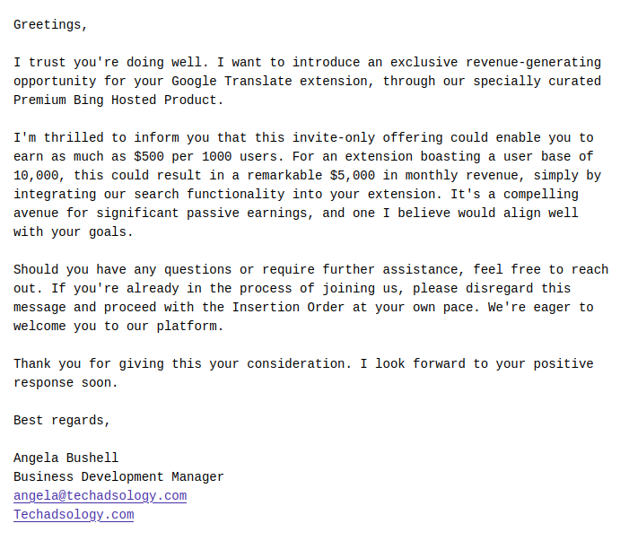
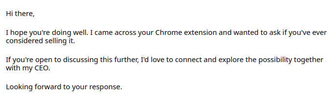

I'm a developer of few browser extensions and every week i receive a numerous offers to "monetize" my projects. Some experienced developers knows, offers like this will inject a malware to a browsers, but scummers will not tell you about it, they offer "integrations" that looks not so suspicious. Imagine how many developers accepted the offers, then look at number of extensions in your browser and think how much risk you have extensions with malware.

A browser extensions may request a lot permissions and it may be really necessary to improve user experience. However, a wide permissions a spread the hacker attack surface, this is why browser extensions a great tool for hackers.

Browser extension can see any content on page, like emails, private messages in social media and bank account information. Extension may listen pressed keys and send a passwords to a hackers. Collected data may be sold or used by hacker to steal money and identity or blackmailing.

Last years a browser extensions became insert advertisements on a web pages. It works like that - browser extension developer signs up on some ads platform and create account for some application, then inject ads on any web pages users visit and earn money on clicks. Sometimes even ads platform doesn't know how developer earn clicks.

It's not all ways how hackers may use malware in your browser, they may click on links, open any sites in background for DDoS purposes and so on. The key point is your browser will be shared with a hacker.

Let's see how extensions may be hijacked in case developer are not hacker.

# Monetization offers of scummers

Extension developer may even not be a hacker, but extension may be hacked by third party.

I frequently received emails like this:

> 

The problem we have is some developers agrees the offers like this. As result, hackers on screenshot above will inject a malware into the clear extensions with good reputation.

Developer may even does not see the problem, he's just will include third party code that not looks as malware and really do things scummers claimed, for example above it may add a Bing suggestions in search.

Malware may intentionally does not executes for some people like developer and app stores reviewers, but executes for users. This is why it is not secure embed external resources like javascript code, but developers do it under different pretexts.

If you are developer and you think about offer like this, remember that you not just betray users who trust you, but also your extension will be removed everywhere in near few months when users will sent enough reports.

# Offers to buy project

Except "monetization offers" my spam folder also contains offers like this

> 

The idea the same - scummers offers to buy a project (usually for funny money like $10.000), but actually they want to buy users to hack and rob them.

# How to protect yourself

As you see, even if a extension developer are not a hacker, you still in danger, because extension still may be hacked.

Browser app stores tries to "moderate extensions", but usually it means the extensions analyzes with a automated tools that tries to detect malware patterns and in case a hacker hide it proper way, a robot will approve new release.

To decrease risks you should keep as minimal extensions as possible and get known more about extension and about its author before install it.

Author must be a real people with github and social media, not a random person.

Author must be high qualified programmer and hacker, otherwise author may be easy deceived by scummers.

Browser extension must be open source. In case if you can't find extension sources, you may be sure it's malware.

The less dependencies extension code have the better for security.

Never install random extensions with no background check.

# What extension developers should do to protect their users

Never allow to embed content from external servers. It mostly about scripts, but external pages in iframe or static resources like media files also may be used by scummers to collect IP addresses of your users or show unacceptable content.

With great power comes great responsibility. You have to be hacker to detect and reject integration offers with scummers. Only one way i see to do it - write code every day and try new things to enrich your experience.

You should also make your code able to develop by other programmers, they may detect your suspicious activity. Add docs with explaining key design principles of your software and invite other developers to review and audit your code.

# Related links

Check out my extension, a [Linguist translate](/blog/2023/07/13/linguist)