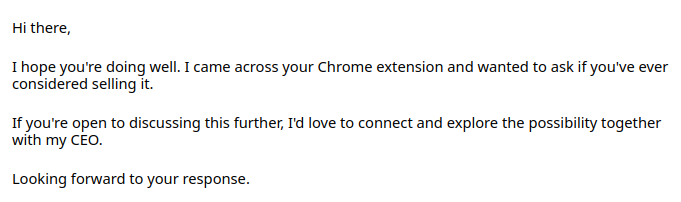

I've developed a few browser extensions, and every week I receive numerous emails with "revenue offer". Some experienced developers know that offers like these will inject malware into the browsers of your users, but scammers who make these offers will not tell you about it. They offer "integrations" that don't look so suspicious. Imagine how many developers have accepted these offers. Then look at the number of extensions in your browser and think about how much risk there is that you have an extension with malware.

Browser extensions may request a lot of permissions, which can be necessary to implement some features and to improve the user experience. However, having wide permissions can increase the attack surface for hackers. This is why browser extensions are a great target for hackers.

Browser extensions can access any content on a page, such as emails, private messages in social media, and bank account information. Extensions may also capture pressed keys and send passwords to hackers. The collected data may be sold or used by hackers to steal money, identities, or for blackmail.

In recent years, browser extensions have started inserting advertisements on web pages. Here's how it works: a browser extension developer signs up on an ads platform and creates an account for some application. Then they inject ads on any web pages users visit and earn money from clicks. Sometimes even the ads platform doesn't know how the developer is generating clicks.

These are not the only ways hackers can use malware in your browser. They can also click on links, open sites in the background for DDoS purposes, and more. The key point is that your browser will be shared with a hacker.

Let's see how extensions can be hijacked in case the developer is not a hacker.

# Monetization offers of scammers

Extension developer may even not be a hacker, but an extension can be hacked by a third party because the programmer is an engineer with a low qualification level who can't detect scams. Social engineering works on programmers as well.

I frequently received emails like this:

> 

The problem we have is that some developers agree to offers like this because they don't understand that it's a scam. As a result, hackers in the screenshot above will inject malware into the clear extensions with good reputation.

Developers may not even see the problem, they might just include third-party code that doesn't appear to be malware and actually accomplishes the things scammers claim. For example, it might add Bing suggestions to searches.

Malware may intentionally not execute for some people, like developers and app store reviewers, but it does execute for users. This is why it is not secure to embed external resources like JavaScript code, but developers do it under different pretexts.

If you are a developer and you are considering an offer like this, remember that you are not only betraying users who trust you, but your extension will also be removed everywhere in a few months when enough reports are sent by users.

# Offers to buy project

Except "monetization offers" my spam folder also contains offers like this

> 

The idea the same - scammers offers to buy a project (usually for funny money like $10.000), but actually they want to buy users to hack and rob them.

# How to protect yourself

As you can see, even if an extension developer is not a hacker, you are still in danger because the extension can still be hacked.

Browser app stores try to "moderate extensions", but usually, this means the extensions are analyzed with automated tools that attempt to detect malware patterns. In cases where a hacker hides it well, a robot will approve the new release.

To decrease risks, you should keep the number of extensions you use to a minimum and learn more about the extension and its author before installing it.

The author must be a real person with a GitHub and social media presence, not just a random person.

The author must be a highly qualified programmer and hacker; otherwise, they may be easily deceived by scammers.

Browser extensions must be open-source. If you can't find the extension's sources, you can be sure it's malware.

The fewer dependencies the extension code has, the better it is for security.

Never install random extensions without conducting a background check.

# What extension developers should do to protect their users

Never allow content to be embedded from external servers. This primarily concerns scripts, but external pages in iframes or static resources like media files can also be used by scammers to collect the IP addresses of your users or display unacceptable content.

With great power comes great responsibility. You have to be a hacker to detect and reject integration offers from scammers. The only way I see to do it is to write code every day and try new things to enrich your experience.

You should also make your code accessible for other programmers to develop. They may detect your suspicious activity. Add documentation that explains the key design principles of your software and invite other developers to review and audit your code.

# Related links

Check out [Linguist translate](/blog/2023/07/13/linguist), a browser extension I created three years ago for myself. This is the most powerful translation in browser on the market today. Read more about it in [my recent post](/blog/2023/07/13/linguist). It is completely free and [open source](https://github.com/translate-tools/linguist).

You can rate Linguist on app stores and share it with friends to help Linguist become a mainstream tool for translation in browsers.

If you like, you can [donate crypto currency](https://github.com/translate-tools/linguist#donations) to support the project because Linguist respects your privacy and rejects "integration offers" that do not align with its principles.

### Another related links
- [List of emails I have received about inserting malware into my extension](https://sponsor.ajay.app/emails/) by [ajayyy](https://github.com/ajayyy), author of great extension [SponsorBlock](https://github.com/ajayyy/SponsorBlock) for skip ads inlined in YouTube videos
- [Temptations of an open-source browser extension developer](https://github.com/extesy/hoverzoom/discussions/670), a long list of emails from scammers