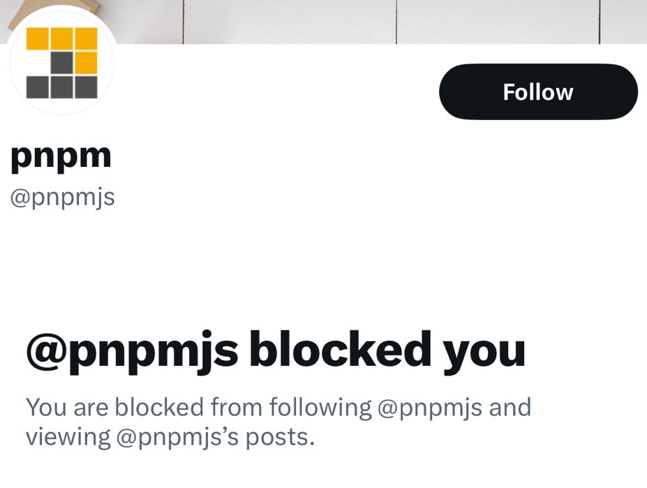

The software that has a political opinion implies a bias and high risk for security. Avoid software with a "position" today, so you don't get hacked tomorrow.

This week I've found [a Twitter post](https://x.com/kozlovzxc/status/1802726956665905234/photo/1) in my feed with a screenshot saying "[@pnpmjs](https://x.com/pnpmjs) blocked you", and my reaction was kind of «wow, it's good I did not start to use PNPM yet and learned about their "opinion" that prompted them to block someone on Twitter and which may be a motivation to inject malware on my PC next time. I've been close to starting to use it in the next months».

There are reasons to consider such threats as real. In fact, we've had too many cases lately that prove over and over that software with any "opinion" or "political views" is dangerous.

A lot of NPM packages contain malware. Usually, they use typosquatting or masquerade tactics and parasitize popular packages, but some of them initially do not contain any malware and become popular. Then something happens in the world, and they attack users for political reasons. This is the story of [CVE-2022-23812](https://github.com/advisories/GHSA-97m3-w2cp-4xx6), a famous NPM package `node-ipc` with over a million weekly downloads that started [deleting all data and overwriting all files](https://www.bleepingcomputer.com/news/security/big-sabotage-famous-npm-package-deletes-files-to-protest-ukraine-war/) on developers' machines to protest the Ukraine war in March 2022.

Cloud services have this problem too. On 30 May 2024, [Docker Hub blocked access for users from Russia](https://therecord.media/docker-hub-suspends-services-russia) for political reasons. GitHub suspends accounts in Russia, Iran, and other countries [[1]](https://www.pcmag.com/news/github-reportedly-suspends-accounts-related-to-sanctioned-russian-orgs), [[2]](https://techthelead.com/russian-developers-get-their-github-accounts-suspended-lose-work-without-warning/), [[3]](https://techcrunch.com/2019/07/29/github-ban-sanctioned-countries/).

Browser extensions, mobile, and desktop apps also implement logic to attack users by regions and based on their political views. Nowadays, there are many teams who buy popular apps and browser extensions to inject malware. I have [a blog post](/blog/2023/09/01/malware-in-browser-extensions) about it.

As you can see, the "opinion" or "political view" of a company is not only a way to hype on sanctions and curry favor with investors, the government, and consumers, but it is also a clear signal about potential threats. It signals that your sensitive data may be hijacked, sold, or wiped anytime if the political compass spins tomorrow and recognizes you as an enemy.

There is no way to completely protect ourselves from cyber attacks, but at least we can avoid software with an "opinion." Good software does not care about how to ban someone on Twitter, how to limit access from some regions, or how to inject malware based on region, religion, or skin color.
