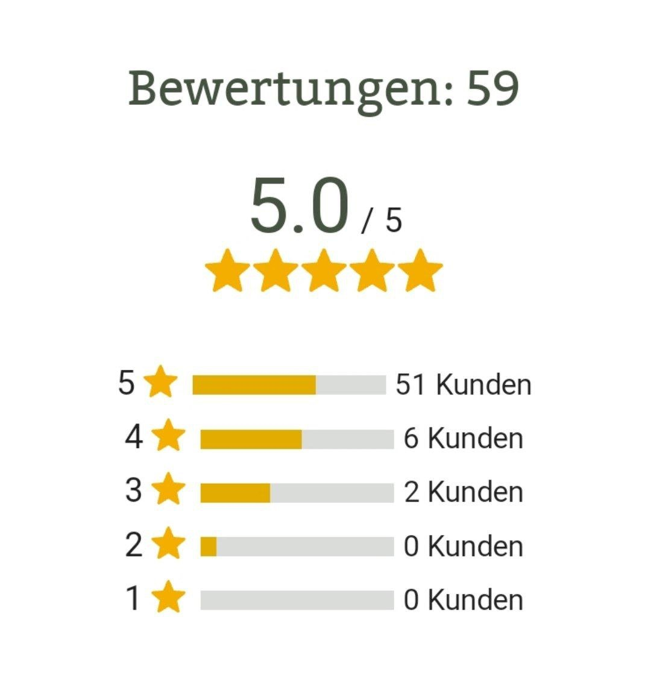
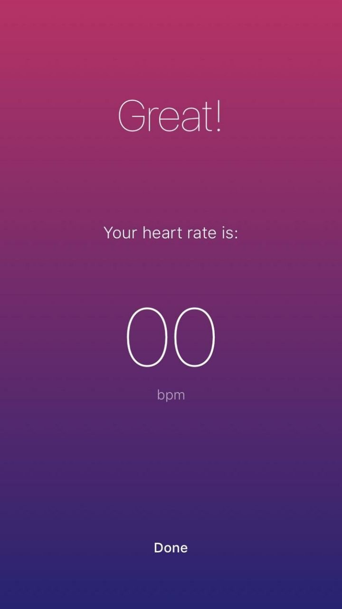

User interfaces everywhere are a bit too generic nowadays, as they must be efficient in terms of maintenance and release time. However, that is not a reason to create a pointless and bad UX. It's enough to monitor the meaningfulness of interfaces and ask yourself, "Does it make sense?" to make the user experience great.

The rule of thumb in UX design is "everything must be intuitively clear".

When a user does not understand how something works, they may prefer to use a competing product or may even make mistakes that could harm others while using your product, as is quite possible in the case of the elevator panel above.

That is a product problem, not a user problem.

## Don't Make Me Guess

Look at the next example:

This is quite a typical and generic UI that tells us, "I don't care. We are here to make money off you. Buy or go away".

How can we improve this UI?
- Make the interface talk to the user simple and clear
- Avoid hidden assumptions and computer language
- Strip away everything that is not really necessary for the user

Users do not need your computer language, so round the numbers.

Instead of `5.0 / 5`, it's better to show `5 of 5`, since the `.0` part has no meaning for the user, it's important only for the computer. Users visit the site to get a service, don't make them overthink and calculate your formulas.

If the decimal part is important, round the numbers. Show `5` instead of `4.5` and `4` instead of `4.4`. That's sufficient if your site is not about math or chemical formulas.

Rounded numbers are better, but it is still not clear what `5` represents.

Make the interface obvious and explicit, replace it with something like `Rating is 5 stars`.

The semantics of the "stars" system are clear enough for human beings and are additionally visually reinforced with five stars below the text.

The same applies to the list with stars. Nobody is interested in your computer data, so it's fine to just remove the entire list of star distribution that merely clutters the page and pretends the site has a lot of content.

If you must include a list of stars, think about showing only meaningful information. For example, do not show stars that have no votes. And, of course, align the text and fix the progress indicator that does not match the ratio of score and filled for 60% for the item `5/5`, which actually means 100%.

## Watch for Meaningfulness

Here’s another example:

> 
>
> Great! It looks like I died.

Or even this one:

> 
>
> Are you sure this is something to brag about?

The problem in both cases is that developers did not implement another condition to handle edge cases, resulting in a pointless state reached by the user.

The solution is obvious — **don't show pointless messages to the user**.

Check if all data makes sense, and if not, simply do not show a message or component.

If you need to fill a screen, **show something truly useful**.

If there are no reviews yet, prompt the user to take action and ask them to write a new review to be the first.

In the case of a heart rate monitor, call emergency services if the user appears unhealthy, or explain to the user what is happening. It could look like a spinner to signal that the data is loading, or it may be a message with a status like "It looks like your sensor is broken, as we can't measure your heart rate".