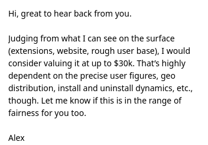

Big tech companies invest a lot of effort to sell us the point that every **good programmer** must have their own open source project. Many programmers have open source side projects, but quite few of them can explain why they waste their time on it. As a result, they work for free, to make big tech rich. Actually, open source can't make money for programmers, but may be useful as a promotion tool for them.

Many programmers who start working on new personal open source projects have a material motivation.

Programmers believe that it is enough to make a cool project, then people will discover it on their own, will like it and start using it, will pay for it, spread the word about the product.

Maybe it's because they have seen too many cool stories of influencers on Twitter and believe it is true.

## Open source gives no money

Reality check #1 - open source gives no money.

While there are news that look like "[Open source software boosted the EU economy by ‘between €65 to €95 bn’](https://www.euractiv.com/section/tech/news/open-source-software-boosted-the-eu-economy-by-between-e65-to-e95-bn-report/)" and "[IBM buying Red Hat for $34 billion](https://www.wired.com/story/ibm-buys-red-hat/)", it proves nothing but that open source is useful for companies to make money on it. Nothing about maintainer earnings.

I can't find any statistics on how many other developers earn on their open source projects, except promoted posts by influencers like [Tailwind CSS: From Side-Project Byproduct to Multi-Million Dollar Business](https://adamwathan.me/tailwindcss-from-side-project-byproduct-to-multi-mullion-dollar-business/), but there are [some articles](https://www.businessinsider.com/open-source-developers-burnout-low-pay-internet-2022-3) with claims like

> A Tidelift survey of nearly 400 open-source maintainers said 46% are paid nothing for their work. Of those who do get paid, only about half receive over $1,000 a year.

I have [a couple of open source projects](https://github.com/vitonsky) too. Some of them are quite successful, like [Linguist](https://linguister.io/) that has over **180k active users**.

My experience is quite similar to the quoted stats. I got **about $3k** in donations for **more than 4 years**. That is about $700 per year.

At my projects, I never asked users for money "for beer" or "for coffee" like many projects do. I have [a post about threats](/blog/2024/06/20/politics-in-software/) of software that acts like that.

But even if it would up donations to $10k per year, it is still nothing compared to the base salary of a programmer in any EU country.

Sometimes I got irrelevant requests to buy a project for ridiculous prices like $30k, which is still lower than the base salary of any programmer in the EU.

> 

I have [a post about such requests](/blog/2023/09/01/malware-in-browser-extensions/#monetization-offers-of-scammers). The summary is that people are looking for projects to buy its user base, to inject malware/spyware/ads and earn more money. By the way, next time you see a request for donations at any project, think about the reasoning in the head of the product owner. What stops them from selling you for $30k if they needed money?

Ask your friends who have open source projects "how much do you make on it?". Probably you will hear the same story.

So don't be confused, you will not earn money on open source pet projects like that. You will just waste your time inefficiently. You can just find a programmer job in some company and have at least $100k base salary.

There are other options to make money on open source that do really work.

One of the most popular is a commercial open source based on the [open core model](https://en.wikipedia.org/wiki/Open-core_model)

> The open-core model primarily involves offering a "core" or feature-limited version of a software product as free and open-source software, while offering "commercial" versions or add-ons as proprietary software.

Another direction, very popular in the USA, is startups that are built to sell as soon as possible. The point is to find a pain, then implement a solution and sell it to anybody before big tech clones it and promotes it with its marketing capacities. Such projects have a short life span and, in terms of time, make enough money to cover spending on programmers, promotion and make extra money.

## Open source is a promotion tool

Many people believe that the secret of success is just to make a cool project, and then other people will discover it and use it.

Reality check #2 - nobody will use your project with no promotion. Any project with no promotion is doomed to fail.

Nobody will even know that your project exists. If you have a product - promote it. If you don't, it will be lost, nobody will find it, and you will just waste your time.

But how to promote your project? The internet is one of the worst places for product promotion because of the high level of spam, it costs a lot and gives low conversion rates.

The goal of any social media platform is to lock their users into an echo chamber, to retain user engagement, so they hide any posts that have not been paid.

**Good news**, open source is a good platform for promotion.

An open source product that fixes real pains will be in demand if you boost it initially among those who have the pain you solve.

Open source projects have a lot of benefits, including **capacities to build trust** in your product and team.

Personally, I'm trying to avoid proprietary software since it has no foundation of trust. Any trust is already destroyed at the first step when a developer spends money to lead me to an app store where there are no links to the source code. Because such software may do anything on my device and I have no chance to figure out how exactly it works. I can't even report bugs or track how development goes.

At [PrimeBits](https://primebits.org), we avoid software that cannot be self-hosted or modified for our needs.

Of course, open source also means that your code may be stolen by some big corporation to [sell it as a cloud service](https://redis.io/blog/redis-adopts-dual-source-available-licensing/), or to modify it for their needs. But those are problems that are good to have.

As a developer, you should use your open source products to build trust and promote related products and services. This is how many open source companies actually make money.

In my case, when [Linguist](https://linguister.io/) started growing, I got 4 new clients for [PrimeBits](https://primebits.org) per one year. They reached us through GitHub, and we built products for them, paid our staff and made enough to maintain Linguist for free. Every such client made us profit in several orders of magnitude higher than $700 per year.

This is one of the most efficient models in terms of time and money. It makes the maintenance of projects with open source code viable, unlike the donations model that can't even cover the cost of a nice mountain bike that saves you from burnout.

## Contribute back!

**Promotion is crucial** for any open source project for both sides, for the developer and **for users**.

Because if you, as a user, found some nice open source project and you do not participate in making it popular, you have a chance to find that a project is lost maintainer.

As I said, donations in open source projects are too small to motivate developers to do anything. Your $10 or $100 is not enough to drive development.

So if you find some nice open source project, keep your money and spread the word about it.

This is more valuable and equal to donating a few thousand dollars.