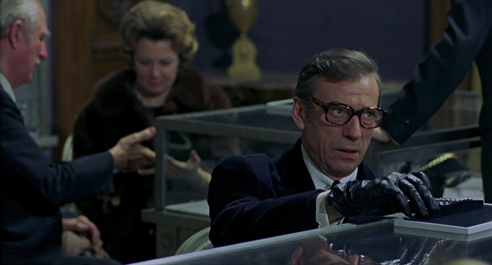

The mainstream technologies to build user interface does not limit programmer how to implement design, so it is simple to build unmaintainable system that won't scale.

<figure>
	
	<figcaption><cite>The Red Circle</cite> (1970)</figcaption>
</figure>

Look at this button built with Tailwind for example:

```html
<button
  className="
    inline-flex items-center justify-center gap-2
    whitespace-nowrap rounded-md text-sm font-medium
    ring-offset-background transition-colors
    focus-visible:outline-none focus-visible:ring-2
    focus-visible:ring-ring focus-visible:ring-offset-2
    disabled:pointer-events-none disabled:opacity-50
    bg-primary text-primary-foreground
    hover:bg-primary/90
    h-10 px-4 py-2
    dark:bg-primary dark:text-primary-foreground
    dark:hover:bg-primary/90
    sm:h-9 sm:px-3
    md:h-10 md:px-4
    lg:text-base
    [&_svg]:pointer-events-none
    [&_svg]:size-4
    [&_svg]:shrink-0
  "
>
  Save changes
</button>
```

You can do the same thing with pure HTML too

```html
<button
  style="
    display: inline-flex;
    align-items: center;
    justify-content: center;
    gap: 0.5rem;
    white-space: nowrap;
    border-radius: 0.375rem;
    font-size: 0.875rem;
    line-height: 1.25rem;
    font-weight: 500;
    transition: color 150ms, background-color 150ms, border-color 150ms,
      text-decoration-color 150ms, fill 150ms, stroke 150ms;
    background-color: var(--primary);
    color: var(--primary-foreground);
    height: 2.5rem;
    padding: 0.5rem 1rem;
  "
>
  Save changes
</button>
```

The problem I point here is a **style inlining**.

Aside from the obvious technical issues of large page size and lack of caching, there are a few important foundational problems:

1. you cannot ensure visual consistency, even in scope of single file
2. such code have no semantic so you can't understand what it does mean
3. such code is difficult to maintain

Even with LLM you will wait long time to make changes, because this error-prone design requires many iterations to correct the result.


## Use variants

To address these problems you should use **variants**.

Define the self-contained style that completely describes all the visual aspects of component, and assign a semantic name on this style.

Then you can use a variant like that

```html
<Button variant="primary">Save changes</Button>
<Button variant="secondary">Cancel</Button>
```

In pure HTML with use BEM methodology it would look like that:

```html
<button class="Button Button__view_primary">Save changes</button>
<button class="Button Button__view_secondary">Cancel</button>
```

*The variant must contain all implementation details for visual.*

Variant must not to expect the styles will be supplemented by any external dependency like "global reset CSS", any in-place styles like `font-family` or anything like this.

The variant definition must include everything to describe the final visual of component including inner geometry, colors and typography.

Variant defines the semantic unit of user interface so it makes design system observable.

With variants you can consistently update design.

You can see how much different buttons you use on project so it is possible to test all combinations of components. It may be useful for example if you want to implement visual tests or demo-stand in storybook for all color schemes to make sure every button variant looks good on every panel variant.

## Use modifiers

When you use UI kit on large project with rich visual design, you can wish to use something like this

```html
<Button
	variant="primary"
	radius="xl"
	fontSize="xl"
	fontWeight={500}
	fontFamily="fancy"
>
	Buy
</Button>
```

Here we use `view` **and** inline styles to patch the component style details.

That's incorrect. *The variant does not define a final view of component anymore*, so it breaks everything and returns us back to the Tailwind example.

The inlined styles may don't match or even conflict with the view styles in case we will update this view later or will introduce another theme/color scheme.

If we need to introduce some invariant for a view, we can implement a **modifiers** to keep it manageable.

The modifier is an API provided by component to let us change its view or behavior. The modifier must be implemented in the same high level as view.

For example we can use `view` to set visual style of button and add modifier `size` to control its geometry.

```html
<Button variant="primary" size="xl">Buy</Button>
```

The implementation example in vanilla CSS with BEM-style modifier:

```css
.button__size_xl {
	border-radius: 12px;
	font-size: 3rem;
	font-weight: 500;
	/* ... */
}
```

CSS modules for Mantine UI:

```css
.root {
	&[data-size="xl"] {
		border-radius: 12px;
		font-size: 3rem;
		font-weight: 500;
		/* ... */
	}
}
```

ChakraUI theme:

```tsx
export default defineConfig({
	theme: {
		semanticTokens: {
			colors: {
				// ...
			},
		},
		recipes: {
			button: defineRecipe({
				variants: {
					size: {
						xl: {
							borderRadius: "12px",
							fontSize: "3rem",
							fontWeight: "500",
						},
					},
					variant: {
						accent: {
							// ...
						},
					},
				},
			}),
		},
	},
});
```

*If we need to apply many modifiers it is signal to introduce another variant*:

```html
<Button variant="fancy-primary" size="xl">Buy</Button>
```

## Design the system

This approach can be applied to most of the UI kits that have not been designed to suffer.

If you follow this approach you eventually build the design system even if you did not have the one before. You will naturally be forced to infer a reused units of the interface.
